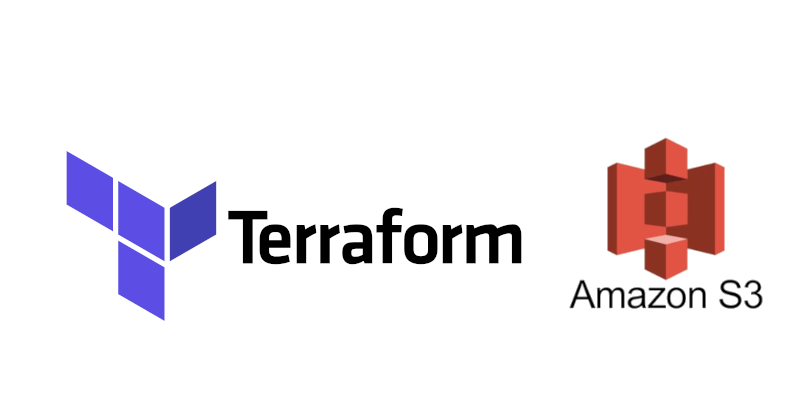

# Hosting a Static Website on AWS S3 using Terraform

`## Steps to Deploy`
 - `Provider Configuration:` specifies AWS and random providers.
 - `Bucket Creation:` Creates an S3 bucket with a unique name.
 - `Public Access:` Configures public access to the bucket
 - `File Uploads:` Uploads the index.html and error.html files to the bucket.
 - `website Endpoint:` outputs the URL of the static website

 
